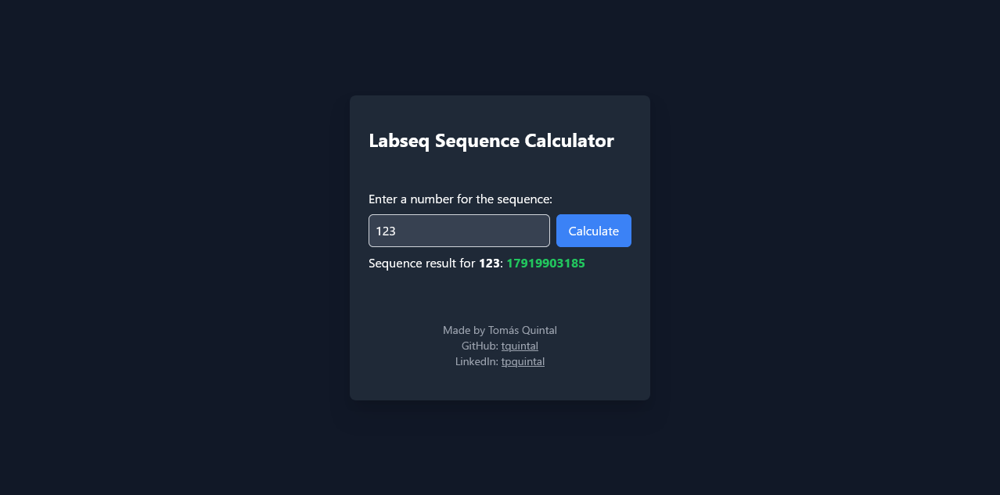
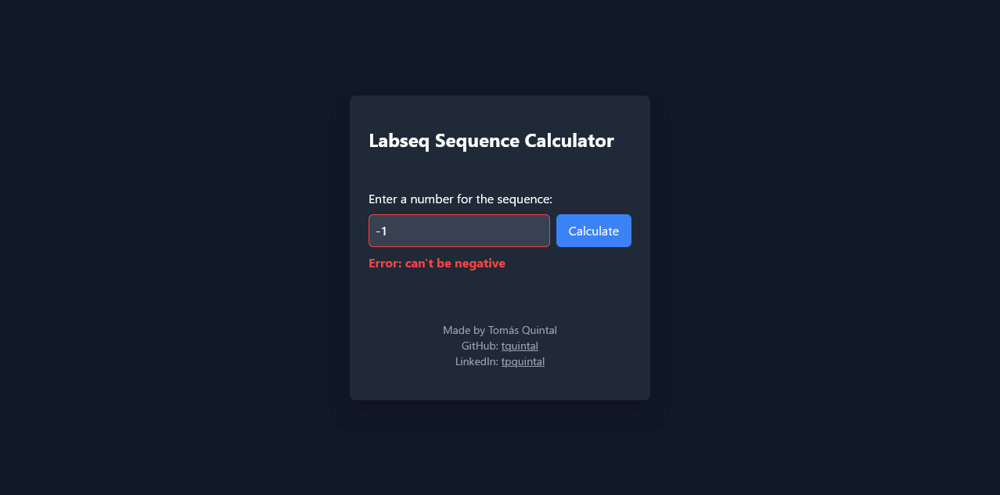
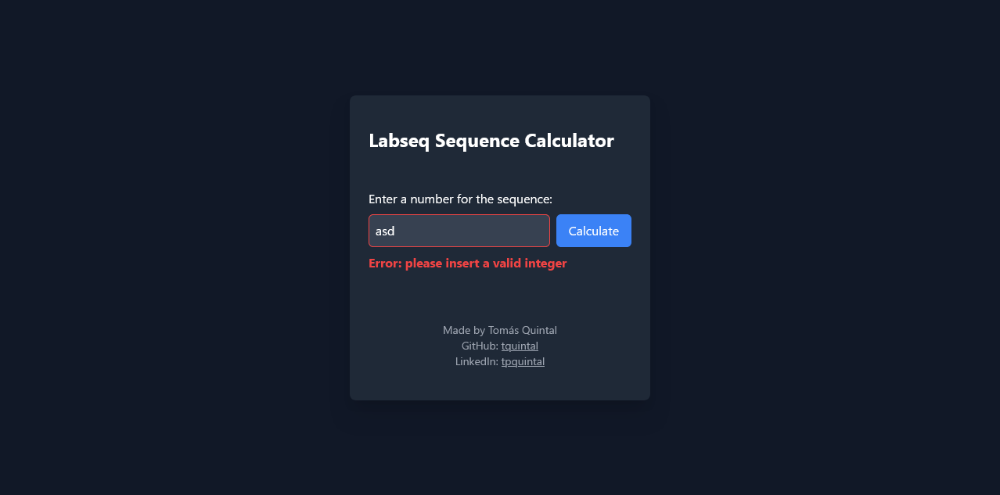

## Labseq Sequence Service

### Introduction

This project implements a REST API service using Quarkus (Java) and a simple JavaScript web GUI using Angular to calculate and return values from the Labseq sequence.

### Requirements

- Java
- Maven
- Node.js and npm

### Running the Project

1. Execute the following command in the project root directory:

   ```bash
   ./start.sh
   ```

   This script will handle building Docker containers for the backend and frontend, starting them, and creating network connections.

2. Access the frontend application at: http://localhost:4200/
3. Access the OpenAPI specification at: http://localhost:8080/q/openapi
4. Accessing the API Documentation (Development Environment Only)

The API documentation provides a comprehensive overview of the available endpoints, parameters, and responses. However, it is only accessible when running the backend in the development environment.

Steps:

    Navigate to the backend directory: cd backend
    Run the development command: quarkus dev
    Access the API documentation: http://localhost:8080/q/swagger-ui/

Note: This documentation is only available during development. For production environments, refer to the provided OpenAPI specification.

### Technologies

- Backend: Quarkus (Java)
- Frontend: Angular with Tailwind CSS

### Project Structure

```
labseq-service/
├── backend/
│   └── ... (Quarkus backend code)
├── frontend/
│   └── ... (Angular frontend code)
└── start.sh  (script to run containers and builds)
└── README.md (this file)
└── docker-compose.yaml (defines containerized environment)
```

### REST API Documentation

The service provides a single endpoint to retrieve Labseq sequence values:

- **Method:** GET
- **URL:** `http://localhost:8080/labseq/{value}`
- **Path Variable:** `{value}` (integer representing the desired sequence index, non-negative)
- **Response:** JSON object containing the calculated Labseq sequence value for the provided index.

### Labseq Sequence Definition

The Labseq sequence `l(n)` is defined as follows:

- `l(0) = 0`
- `l(1) = 1`
- `l(2) = 0`
- `l(3) = 1`
- `l(n) = l(n-4) + l(n-3)` for `n > 3`

### Caching Mechanism

The service employs a caching mechanism to optimize performance by storing previously calculated values. This cache is utilized within the Labseq sequence calculation algorithm.

### Challenge Assumptions

- The provided implementation assumes a specific caching mechanism (details to be implemented in the backend code).
- Error handling and input validation are not explicitly mentioned but can be incorporated for robustness.

### Performance Considerations

The solution aims to achieve a response time under 10 seconds for calculating `l(10000)`. Optimization techniques like memoization or dynamic programming can be explored for further performance improvements.

### Frontend

The included Angular frontend provides a basic interface to interact with the API. You can customize or extend it based on your specific needs.

### Screenshots




